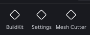
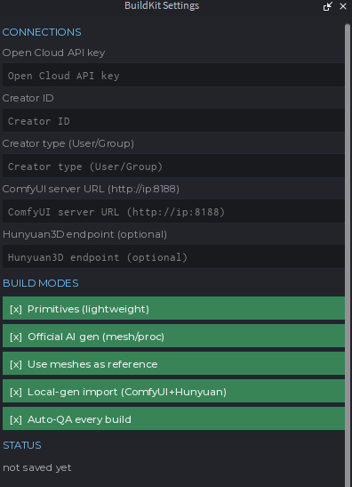
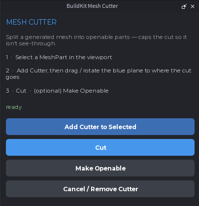

# roblox-buildkit

A Roblox Studio plugin + agent skill that gives an AI agent a **steerable camera**, **cutaway/floor-plan capture**, and **parametric build primitives** — so it can *see exactly* what it builds instead of guessing camera coordinates.

This repo ships the **plugin** (source + built `.rbxmx`), the **MCP server** that relays commands, and the **skills** (in `skills/`) that drive it.

## How it works

Studio plugins can't listen for connections or screenshot the viewport. So:

- The **MCP server** (a small Node process) talks MCP over stdio to the agent, and runs a tiny localhost HTTP server.
- **BuildKitPlugin** (Luau) long-polls that HTTP server, runs commands in the Edit datamodel, posts results back.
- **Capture** = the server takes an OS-level screenshot of the Studio window (PowerShell). Because the plugin sets `workspace.CurrentCamera.CFrame`, the window screenshot shows exactly the framed view.

```
Agent ──stdio──► MCP server ──HTTP long-poll──► BuildKitPlugin (Studio)
                     │
                     └── PowerShell ──► screenshot Studio window ──► PNG to agent
```

## Tools

### Seeing what it builds

| Tool | What it does |
|------|--------------|
| `rbx_frame` | **Primary capture path.** Compute `camera_position` + `look_at_position` framing a target's bbox, without moving the camera — feed the coords to the official `screen_capture`. |
| `rbx_capture` | Screenshot with scene setup (cutaway / isolate / annotate / contrast) applied **and guaranteed torn down** around it. Needs Studio in the foreground. |
| `rbx_floor_plan` | Top-down capture with everything above `ceilingY` hidden (interior layout). |
| `rbx_orbit` | Turntable of N evenly-spaced labeled views in one call — batches angles that would otherwise be 2 calls each. |
| `rbx_watch` | Samples the viewport on a timer **inside one call** → labeled sequence. The only way to watch motion faster than your own round trips. |
| `rbx_describe` | Compact JSON scene readback: name/class/bbox per node + part props (anchored/material/color). |
| `rbx_find` | Search the scene: name substring, `className` (IsA), CollectionService tag, attribute, or proximity. |
| `rbx_inspect` | Bounding-box center/size, part count, immediate children of a target. |
| `rbx_selection` | Get/set the Studio selection. |
| `rbx_measure` | Distance + axis delta between two points/instances. |
| `rbx_cast` | Raycast or box/sphere volume query (line-of-sight, ground height, clearance, "what's here"). |
| `rbx_navcheck` | PathfindingService walkability check between two points; optional neon path visualization. |
| `rbx_annotate` | Overlay a bbox outline + W×H×D dimension label on a target. |
| `rbx_isolate` | Hide everything but a target for one shot. |
| `rbx_restore` | Escape hatch: un-hide / un-recolor **everything** left over from a cutaway, isolate, or contrast — no token needed. |
| `rbx_qa` | Geometric lint: unanchored parts, duplicate placement, interpenetration, and more. |
| `rbx_optimize` | Runtime/streaming audit: part counts, CollisionFidelity, unanchored geometry, StreamingEnabled. |

### Building & editing

| Tool | What it does |
|------|--------------|
| `rbx_build` | Parametric primitives: `slab`, `room` (walls+floor+ceiling+openings), `stairs`, plus furniture/prop presets. |
| `rbx_edit` | Modify an existing target in place — one undo step. |
| `rbx_batch` | Run several build/edit ops in one call = one undo step + one round trip. |
| `rbx_group` | Group/ungroup/weld parts (kind-tag models like 'drawer'/'door'). |
| `rbx_prop` | Read/write any instance property (Transparency, Anchored, Material, custom props) without Luau. |
| `rbx_attr` | Get/set/list Attributes (gameplay state). |
| `rbx_tag` | Add/remove/list/query CollectionService tags. |
| `rbx_script` | Read script source, list scripts, grep for a string (understand existing code). |
| `rbx_sync` | Push on-disk `.luau` files into Studio's DataModel (Rojo gap-fix). |
| `rbx_insert` | Insert a marketplace/toolbox asset by numeric id, anchor + place it. |
| `rbx_gui` | Build a styled ScreenGui from a component tree (themes: noir/clean/neon). |
| `rbx_gui_preview` | Toggle the CoreGui edit-time preview of a built ScreenGui. |
| `rbx_checkpoint` | Save a hard checkpoint clone; restore it later (one undo step). |
| `rbx_diff` | Compare two trees/checkpoints — added/removed/changed, keyed by path. |
| `rbx_undo` | Undo/redo BuildKit mutations (also Ctrl+Z). |
| `rbx_gen_mesh` | Text prompt or image → local AI mesh → MeshPart inserted into Studio. **Optional** — see [Local mesh generation](#local-mesh-generation-optional). |

### Studio & play mode

| Tool | What it does |
|------|--------------|
| `rbx_status` | Is the plugin connected/polling? Which places are connected? Active place filter? |
| `rbx_use_place` | Route commands only to the Studio whose place name matches, when multiple are running. |
| `rbx_set_lighting` | `day` (bright capture) / `noir` (restore moody look). |
| `rbx_console` | Read the Studio output log in-channel (prints/warnings/errors, filtered). |
| `rbx_run` | Run Luau in the live game via the runtime harness (last resort — prefer official `execute_luau`). |
| `rbx_runtime` | Install/remove the play-mode runtime harness. |

## Install

**1. Build the MCP server**
```powershell
cd <repo-dir>
npm install
npm run build      # tsc → dist/, then regenerates + installs the plugin .rbxmx
```

**2. Install the plugin** — copy `plugin/BuildKitPlugin.rbxmx` into your local Roblox Studio **Plugins** folder (Studio → Plugins → Plugins Folder), then enable it. Restart Studio (or it loads on next focus). Click the **BuildKit** toolbar button to confirm it's ON.

**3. Install the skills** — copy the `skills/` folder contents into your agent's skills directory (see [`skills/README.md`](skills/README.md)).

**4. Register the MCP server** — point the agent's MCP client at the built `dist/index.js` (see [`skills/README.md`](skills/README.md) for a copy/paste config).

> **Server lifecycle:** the server is a standalone Node process — it starts when your agent session starts (the MCP client spawns `node dist/index.js`) and stops when the session ends. Studio opening/closing is decoupled: the plugin long-polls the server and auto-reconnects on its own (backs off 1s and retries while the server is down).

## For users: a quick tour

Once the plugin is installed and Studio is open, the **BuildKit** toolbar appears with three buttons: **BuildKit** (toggle polling on/off), **Settings**, and **Mesh Cutter**.



### 1. Turn it on

Click the **BuildKit** toolbar button so it's active (highlighted). This starts polling the MCP server on `127.0.0.1:44760`. The button state is just a toggle — if the server isn't running yet, the plugin keeps retrying in the background and connects automatically the moment it's up.

### 2. Add your Open Cloud credentials (optional)

Click **Settings** to open the BuildKit Settings panel:



The **CONNECTIONS** section holds the values the server needs for AI mesh uploads:

- **Open Cloud API key** — your Roblox Open Cloud key (used for asset uploads via `rbx_gen_mesh`)
- **Creator ID / Creator type** — the user or group that owns uploaded assets
- **ComfyUI server URL** — where local image generation runs (e.g. `http://192.168.1.10:8188`)
- **Hunyuan3D endpoint** — optional, for local 3D mesh generation

The **BUILD MODES** toggles let you enable/disable which build backends the agent is allowed to use (lightweight primitives, official AI generation, local-gen import, etc.).

Set the values, then press **Save** (writes them to `~/.buildkit/config.json` and pushes them to the server) or **Test** (pushes without saving). The key never lands in your place file.

### 3. Cut meshes without leaving Studio (optional)

Click **Mesh Cutter** to open the mesh editing panel:



This lets you split a MeshPart in-place using an EditableMesh plane cut — no Blender, no re-upload. Cut a two-piece model into halves, then **Make Openable** to turn it into a hinged chest. Each cut is one undo step (Ctrl+Z).

### 4. Let the agent drive

Everything above just gives the agent hands-on access. The real workflow is: you tell your agent what to build, and it uses the `rbx_*` tools (see [Tools](#tools)) to capture, build, inspect, and QA the scene through the plugin. Studio stays open and on-screen during capture.

## For agents: install this for the user

If the user asks you to install roblox-buildkit, follow these steps:

1. **Check the repo** — it should be cloned somewhere stable, e.g. `C:\Users\<user>\roblox-buildkit` (or `<user>/src/roblox-buildkit` on macOS/Linux). Clone it if missing:
   ```
   git clone https://github.com/zouploop/Roblox-BuildKit.git
   ```
2. **Build the server** — in the repo dir: `npm install` then `npm run build`. This compiles `src/` → `dist/` and regenerates + installs `plugin/BuildKitPlugin.rbxmx` into Studio's Plugins folder.
3. **Install the plugin** — `npm run build` already copies the `.rbxmx` to `%LOCALAPPDATA%\Roblox\Plugins\` (Windows). Verify `plugin/BuildKitPlugin.rbxmx` is in that folder; the user may need to restart Studio and click the **BuildKit** toolbar button to enable polling.
4. **Install the skills** — copy the contents of the `skills/` folder into the agent's skills directory.
5. **Register the MCP server** — add to the agent's MCP config (e.g. `~/.mcp.json`, or run the agent's equivalent of `claude mcp add`):
   ```json
   {
     "mcpServers": {
       "roblox-buildkit": {
         "command": "node",
         "args": ["<repo-dir>/dist/index.js"]
       }
     }
   }
   ```
6. **Verify** — after a restart, call `rbx_status`; it should report the plugin connected and polling. Studio and the server can start in any order.

## Local mesh generation (optional)

`rbx_gen_mesh` drives a **local** generation chain (ComfyUI → Hunyuan3D → Blender → Open
Cloud upload) that runs on your own GPU. That pipeline lives in `pipeline/gen_to_roblox.py`
and is **not part of this repo** — a plain clone doesn't have it.

The server checks for the script at startup and only registers `rbx_gen_mesh` when it's
actually there, so a normal install simply doesn't see the tool (you'll get one line on
stderr saying it's disabled). Nothing else is affected. To enable it, drop the pipeline in
place and add your Open Cloud key + Creator ID via the plugin's **Settings** panel.

## Development

```powershell
npm install
npm run build   # tsc -> dist/, then regenerate + install the plugin .rbxmx
npm test        # vitest: path mapping, GUI theme resolution, bridge routing + failover
```

The tests cover the pure-TypeScript layer (`src/sync.ts`, `src/gui.ts`, `src/bridge.ts`);
the bridge suite drives real HTTP with a fake plugin, so the long-poll contract, place/ctx
routing, shared-bridge promotion, and the endpoint guards are all exercised for real. The
Luau plugin needs Studio and isn't covered — change it with corresponding care.

The Luau source of truth is the ordered ModuleScripts in `plugin/src/` (`00-` … `140-`).
`plugin/BuildKitPlugin.rbxmx` is the single generated artifact, tracked so users can install
without the toolchain: edit `plugin/src/`, run `npm run build`, and commit the regenerated
artifact. CI fails if it drifts.

## Notes / limits

- Capture brings Studio to the foreground and grabs the window (CopyFromScreen) — reliable for GPU 3D content, but Studio must not be fully off-screen. With several Studios open, set the active place filter (`rbx_use_place`) and the grab targets the matching window.
- Plugin uses a fixed command vocabulary (no arbitrary Luau eval — plugins can't `loadstring`). Use the official `execute_luau` for ad-hoc code.
- Port defaults to 44760 (`BUILDKIT_PORT` env to change; must match `BASE` in the plugin).
- **Optional bridge auth (recommended on a shared machine).** Set `BRIDGE_TOKEN` when starting
  the server (or add `"bridgeToken"` to `~/.buildkit/config.json`); then every plugin-boundary
  request must present the same token. Paste the same value into the plugin's Settings panel
  → *Bridge token*. When set, the plugin only auto-pushes its saved creds to a server that
  validates the token. The token is still a *localhost* trust boundary — a local process that
  binds port 44760 first can read it from the plugin's request — so it defends against rogue
  *clients* driving the bridge, not against a pre-existing port squatter.
- Without a token, the bridge binds `127.0.0.1` only and rejects browser-origin requests (so a
  web page can't reach it), but any *local* process can drive your Studio through it —
  including `sync`, which writes script source into the open place. Same trust boundary as any
  local dev server; be aware of it on a shared machine.
- A capture that fails partway can leave parts hidden or recolored. Each such change now
  also records its original value as an attribute on the part, so `rbx_restore` (or just
  reloading the plugin) puts everything back — even in a later Studio session.
